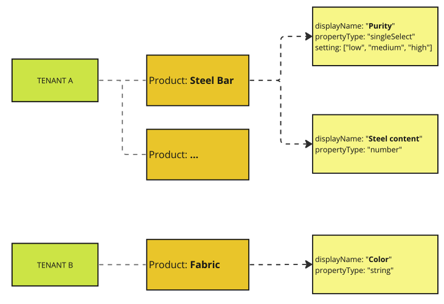
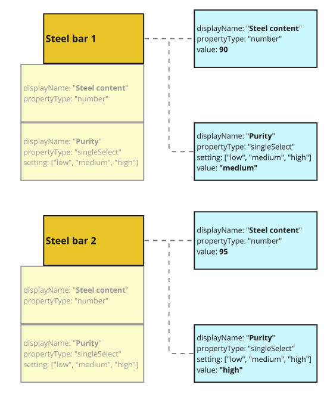
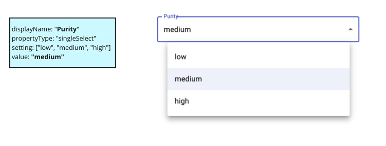

# Custom Properties

## Motivation

To illustrate the business need behind the concept of custom properties, consider the following example:

The application supports multiple tenants, and each tenant defines their products, materials, and machines. Every tenant has the desire to tailor these entities according to their specific requirements. For instance, Tenant 1 might want to introduce a custom 'color' property for fabric materials with options like 'blue,' 'green,' and 'red,' while Tenant 2 could be interested in adding a 'carbon level' property for steel.

As a result, we require a flexible system that enables the addition of custom properties to various entities (such as machines, products, etc.).

## How Do Custom Properties Work

Custom properties allow each tenant to tailor the application to their specific requirements. To understand how custom properties function, let's break it down:

### Tenant Mapping

Each tenant has products, and these products can be customized with custom property definitions. Here's an overview:



This high-level definition provides a generic term for a product. Individual product instances will have specific values for custom properties. 

### Product Mapping

Specific products have instances of custom properties with unique values:



The combination of a specific definition and its associated value for the custom field allows us to render the appropriate UI element for it.

### Mapping to UI

Mapping these custom properties to the user interface results in a tailored experience:



By following this process, each tenant can customize the application to meet their unique needs.

## Custom Property Types

We have the following custom properties:

### String

Represents a custom property with a text value.

### Number

Represents a custom property with a numeric value.

### Single Select

Represents a custom property with a single-selection dropdown. You can define a list of options from which users can choose.

### Multi-Select

Represents a custom property with multi-selection options. Users can select one or more values from a predefined list.

## Examples

Here are some examples of how to define and work with custom properties:

TODO - add image for parser and explain the runtime

#### Defining a Single Select Property

```typescript
const colorProperty: SingleSelectCustomProperty = {
  id: "1",
  displayName: "Color",
  propertyType: CustomPropertyType.SingleSelect,
  propertyDefinitionId: "1",
  value: "Red",
  setting: {
    options: [
      { id: "1", displayName: "Red" },
      { id: "2", displayName: "Blue" },
      { id: "3", displayName: "Green" },
    ],
  },
};
```
