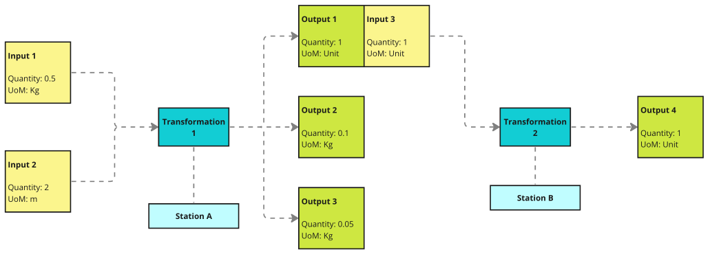

# Material Transformation

## Motivation
The manufacturing process involves stations and materials/products, which are transformed into other materials or products.

A single station can accept multiple inputs and produce multiple products. Furthermore, a single station may offer multiple transformations. For example, consider a station that can be used to create hammers (one type of transformation) or screwdrivers (another type).

## Representation
We refer to the manual for the transformation as the "Transformation Formula," which you can find in [TransformationFormula.ts](./types/TransformationFormula.ts).

Stations can have multiple transformation formulas, representing the capability of being multi-use stations.

The formula accepts a Production Entity Instance (instead of just a definition) because it allows us to specify the quantity of units required for the transformation and enables us to define specific property values.

Since the outputs of one station can be used as inputs for another station, we need to store this information. This is why the Production Entity Instance object is extended with source and target properties, enabling us to capture these connections.

The entire concept is visually represented in the picture below. In our example, the "Output 1" object would contain "Input 3" in its `targetInputId` property, while "Input 3" would have "Output 1" in its `targetInputId`.

